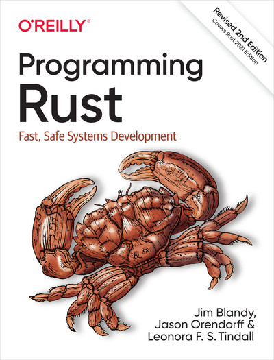

## Code for [Programming Rust, 2nd Edition](https://learning.oreilly.com/library/view/programming-rust-2nd/9781492052586/)

### Table of Contents
1. Systems Programmers Can Have Nice Things
2. A Tour of Rust
3. Fundamental Types
4. Ownership and Moves
5. References
6. Expressions
7. Error Handling
8. Crates and Modules
9. Structs
10. Enums and Patterns
11. Traits and Generics
12. Operator Overloading
13. Utility Traits
14. Closures
15. Iterators
16. Collections
17. Strings and Text
18. Input and Output
19. Concurrency
20. Asynchronous Programming
21. Macros
22. Unsafe Code
23. Foreign Functions
